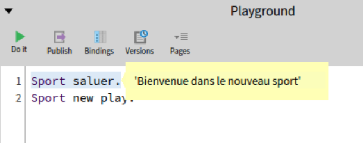
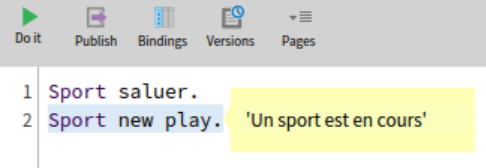

# Dimos MOUSSED-WERNITZ  
### Objets vs Données  
L'API en Pharo est très riche comparé à Java.  
Le problème d'une API moins riche est que quand un objet y est exposé, cela favorise la duplication de logique ou de code.  
En réalité Les Objets sont plus que de simples structures de données. Le plus important est le comportement et les services qu'ils apportent.  
Les clients devraient pouvoir être en mesure de réutiliser la logique encapsulé par le parent.  
### Variables globales  
Les variables globales peuvent prendre différente formes.  
Elles peuvent être déguisée. Il faut éviter d'utiliser les `asClass`. Mais on pourrait déléguer la variable au système pour avoir son environnement.  
Le bon point des var. globales est que quand elles changent, tous les utilisateurs sont mis à jour gratuitement.  Mais donc il faut garder à l'esprit que ces variables partagés devraient être mises à jour.  

### Quelques exemples de méthodes  
Pour bien saisir la différence entre les méthodes de classe et les méthodes d'instance je me suis fait une Clase `Sport` et j'ai ajouté une méthode d'instance et une méthode de classe :  

  

J'ai ensuite décidé de créer une sous-classe `Football` qui hérite de Sport et personnalise la méthode `play`.
Et ainsi de suite avec `FootballPro` pour utiliser super :  

  

## Etape 1 du projet  
J'ai commencé à lire le code du projet CHESS, à comprendre la structure du projet, et à comprendre la structure des classes.  
Et j'ai donc écris un test qui concerne le déplacement basique d'un pion, histoire de m'acclimater au projet.
Voici mon test, fonctionnel :  
